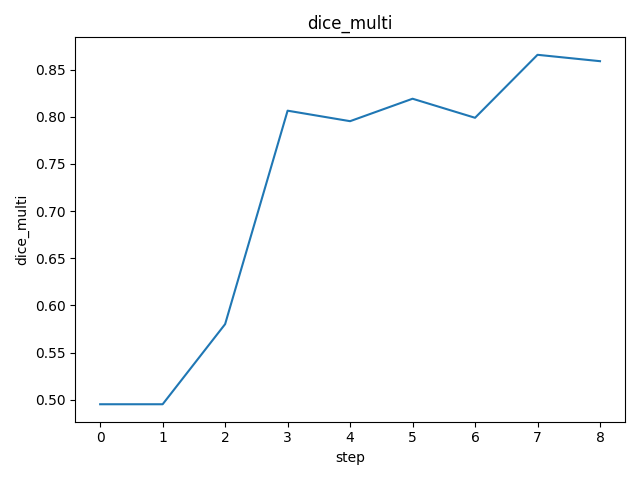
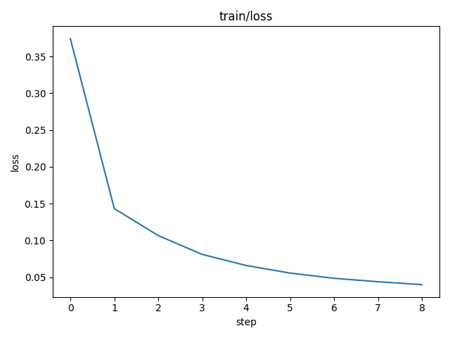
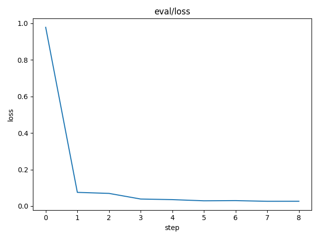

# DVC Report

params.yaml

| model       |   batch_size |   batch_per_epoch | frozen   |   frozen_idx | transforms                                                      |
|-------------|--------------|-------------------|----------|--------------|-----------------------------------------------------------------|
| DynamicUnet |           10 |                 6 | False    |            0 | [Pipeline: PILBase.create, Pipeline: partial -> PILBase.create] |

metrics.json

| train                          | eval                          |   dice_multi |   step |
|--------------------------------|-------------------------------|--------------|--------|
| {'loss': 0.032296765595674515} | {'loss': 0.01982652209699154} |     0.902396 |      8 |

